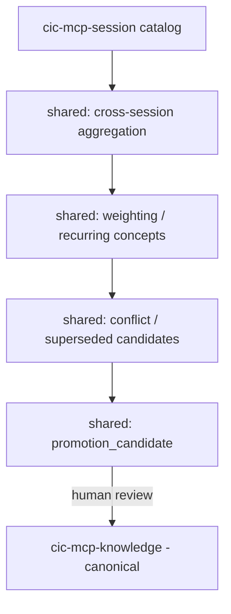

# System Architecture Overview

This document provides a high-level overview of the `cic-mcp-shared` component's architecture
and its role within the `cic-mcp-*` family. The goal is for a new developer/agent to understand
the component's fundamental concepts and boundaries within 5-10 minutes.

The full, normative design source lives in the `cic-mcp-factory` repo:
[`.cic-context/factory-docs/architecture.md`](https://github.com/CentralInfraCore/cic-mcp-factory/blob/main/.cic-context/factory-docs/architecture.md#cic-mcp-shared) —
this document is the shared-specific excerpt of it.

## The "Shared layer" concept

In the trust-domain layering of the `cic-mcp-*` family, this component **merges multiple
sessions**, identifies recurring concepts, weighting and promotion candidates — but it is
never the first source of truth, and never canonical.

```text
cic-mcp-knowledge   reviewed/canonical knowledge, versioned
cic-mcp-workdir     current repo/worktree/branch/diff (role filled by cic-factory)
cic-mcp-session     session-scope event, timeline, chunk, retrieval, provenance
cic-mcp-shared      cross-session memory, weighting, conflict               ← THIS REPO
cic-mcp-gateway     trust-domain aware context compiler
cic-mcp-factory     the family's capability production/maintenance factory
```

## Boundaries

**Yes:**
- merging multiple sessions
- factory job/PR/artifact linkage
- identifying recurring concepts
- weighting
- conflict/superseded candidates
- promotion candidates

**No:**
- being the first source of truth for raw hook ingestion
- canonical layer

## Trust model

```yaml
trust: mixed / candidate / reviewed_shared
canonical: false   # by default
```

The shared layer never builds canonical fact automatically — knowledge promotion is a
separate, human review flow (thead02), not this layer's job.

## Planned data flow (not yet implemented)



Consumes `cic-mcp-session` through the session API/MCP boundary, never direct table access.
Capability job order: `shared-session-catalog-consumer-001` →
`shared-cross-session-search-001` → `shared-weighting-model-001`.

## Current state

The repo was bootstrapped from the `base-repo` `mcp/main` MCP server scaffold (2026-06-20) —
none of the above data flow is implemented yet, `source/` is empty. The Phase 4 capability
jobs are now listed in `job-slices.yaml`, but have not run yet.
