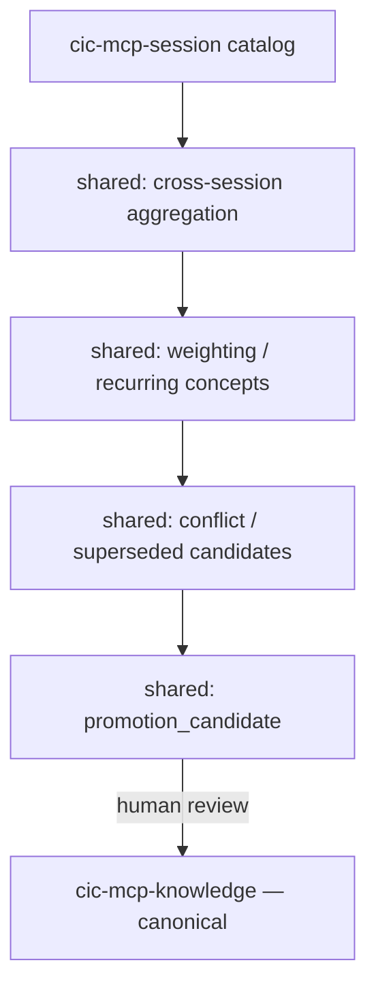

# Rendszer Architektúra Áttekintés

Ez a dokumentum a `cic-mcp-shared` komponens magas szintű architektúráját és a `cic-mcp-*`
családban betöltött szerepét mutatja be. A cél, hogy egy új fejlesztő/agent 5-10 perc alatt
megértse a komponens alapvető koncepcióit és határait.

A teljes, normatív tervezési alap a `cic-mcp-factory` repóban él:
[`.cic-context/factory-docs/architecture.md`](https://github.com/CentralInfraCore/cic-mcp-factory/blob/main/.cic-context/factory-docs/architecture.md#cic-mcp-shared) —
ez a dokumentum annak a shared-specifikus kivonata.

## A "Shared réteg" koncepció

A `cic-mcp-*` család trust-domain rétegezésében ez a komponens **több session-t fűz össze**,
visszatérő fogalmakat, súlyozást és promotion-kandidátusokat jelöl ki — de sosem ő az első
igazságforrás, és sosem canonical.

```text
cic-mcp-knowledge   reviewed/canonical tudás, verziózott
cic-mcp-workdir     aktuális repo/worktree/branch/diff (= cic-factory szerepe)
cic-mcp-session     session-scope event, timeline, chunk, retrieval, provenance
cic-mcp-shared      cross-session memória, súlyozás, konfliktus               ← EZ A REPO
cic-mcp-gateway     trust-domain aware context compiler
cic-mcp-factory     a család capability gyártó/karbantartó factory-ja
```

## Fő határok

**Igen:**
- több session összefűzése
- factory job/PR/artifact kapcsolás
- visszatérő fogalmak azonosítása
- súlyozás
- konfliktus/superseded jelöltek
- promotion candidates

**Nem:**
- raw hook ingestion első igazságforrása
- canonical layer

## Trust modell

```yaml
trust: mixed / candidate / reviewed_shared
canonical: false   # by default
```

A shared réteg nem épít canonical tényt automatikusan — a knowledge promotion külön, emberi
review-flow (thead02), nem ennek a rétegnek a feladata.

## Tervezett adatfolyam (még nem implementált)



A `cic-mcp-session`-t a session API/MCP határon keresztül fogyasztja, közvetlen tábla-hozzáférés
nélkül. A capability-jobok sorrendje: `shared-session-catalog-consumer-001` →
`shared-cross-session-search-001` → `shared-weighting-model-001`.

## Jelenlegi állapot

A repo a `base-repo` `mcp/main` MCP-szerver scaffold-jából lett bootstrapelve
(2026-06-20) — a fenti adatfolyamból jelenleg semmi nincs implementálva, a `source/` mappa
üres. A Phase 4 capability-jobok jelenleg vannak felvéve a `job-slices.yaml`-ba, de még
nem futottak.
